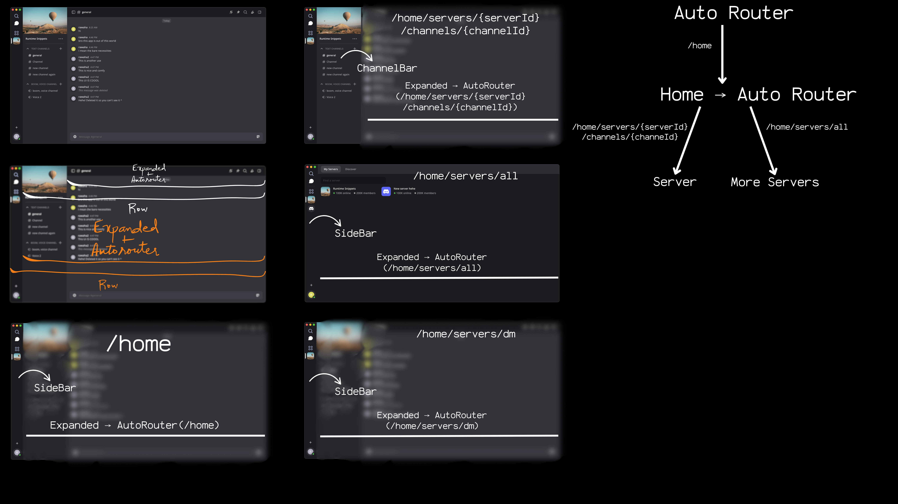
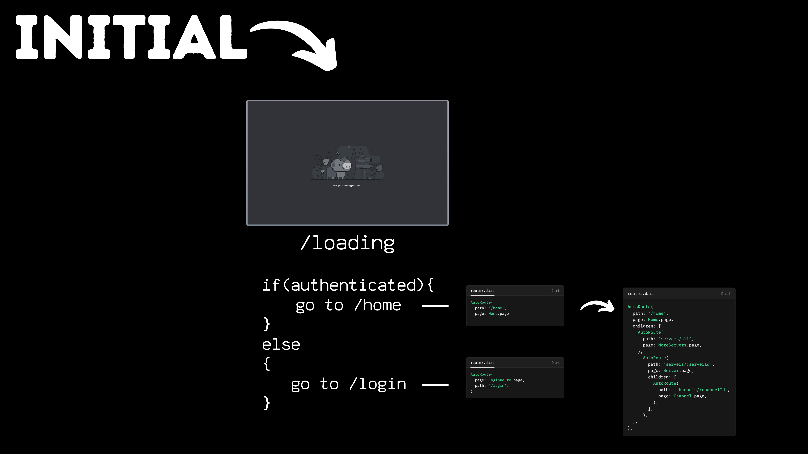
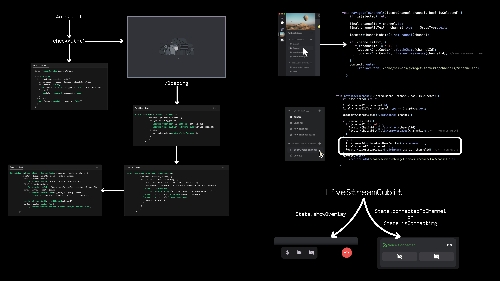

# Discord Open - Enterprise Communication Platform

A modern, enterprise-ready communication platform built with Flutter, Serverpod, and LiveKit for real-time communication and live streaming capabilities. 

**Originally inspired by the Discord redesign concept, now evolved into an independent corporate communication solution.**

## 🔗 Links

- **Repository**: https://github.com/felipemacedo1/discord_open
- **Original Inspiration**: [Juxtopposed's Discord Redesign](https://www.youtube.com/@juxtopposed)

## 📖 Explainer Resources

### Layout Explainer (8K)


### Routing Explainer (8K)


### State Management Explainer (8K)


## 🚀 Features

### Core Features
- **Real-time Chat**: Instant messaging with support for text channels
- **Voice & Video Calls**: Live streaming with WebRTC technology
- **Server Management**: Create and manage communication servers
- **User Authentication**: Secure authentication system with support for SSO/SAML (planned)
- **Cross-platform**: Works on mobile (iOS/Android), desktop (macOS), and web
- **Modern UI**: Dark theme with clean, professional design
- **Live Streaming**: High-quality video calls with screen sharing
- **Channel Management**: Text and voice channels within servers
- **Responsive Design**: Optimized for all screen sizes
- **Enterprise-Ready**: Built with security, compliance, and scalability in mind

## 📸 Project Images

### Chat Section on Android


### Server and Channel Section on Android


### Chat Section on iOS


### Server and Channel Section on iOS


### Voice Call on macOS


### Video Call on macOS


### Screen Share on macOS


### Voice Call on Web


### Video Call on Web


### Screen Share on Web


## 🏗️ Architecture

This project follows a clean architecture pattern with three main components:

### 1. **discord_flutter** - Frontend Application
- **Framework**: Flutter with Dart
- **State Management**: BLoC (Business Logic Component) pattern
- **Navigation**: Auto Route for type-safe navigation
- **UI**: Custom Discord-inspired components
- **Dependencies**: 
  - `flutter_bloc` for state management
  - `auto_route` for navigation
  - `livekit_client` for video calls
  - `flutter_webrtc` for WebRTC functionality
  - `freezed` for immutable data classes

### 2. **discord_server** - Backend Server
- **Framework**: Serverpod (Dart-based backend)
- **Authentication**: Serverpod Auth with email
- **Real-time**: WebSocket connections for live updates
- **Live Streaming**: LiveKit integration for video calls & screen share
- **API**: RESTful endpoints with type-safe client generation

### 3. **discord_client** - Generated Client
- **Purpose**: Type-safe client for server communication
- **Generation**: Auto-generated from Serverpod backend
- **Features**: Automatic serialization/deserialization

## 📋 Prerequisites

Before running this project, ensure you have the following installed:

- **Dart SDK**: `>=3.3.0 <4.0.0`
- **Flutter SDK**: `>=3.19.0`
- **LiveKit Server**: For video calling functionality

## 🛠️ Installation & Setup

### 1. Clone the Repository
```bash
git clone https://github.com/felipemacedo1/discord_open.git
cd discord_open
```

### 2. Setup Backend Server

**⚠️ Important: Configure environment variables first!**

```bash
cd discord_server

# Copy and configure environment variables
cp .env.example .env
# Edit .env with your actual values (see docs/ENVIRONMENT_SETUP.md)

# Install dependencies
dart pub get

# Generate environment code
dart run build_runner build --delete-conflicting-outputs

# Start database
docker-compose up --build --detach

# Create and apply migrations
serverpod create-migration
dart bin/main.dart --apply-migrations --role=maintenance

# Generate Serverpod code
serverpod generate

# Run the server
dart run bin/main.dart
```

The server will start on `http://localhost:8080` by default (configurable via `.env`).

### 3. Setup Flutter Application

```bash
cd discord_flutter

# Install Flutter dependencies
flutter pub get

# Generate freezed files (required for cubit states)
dart run build_runner build -d

# Run the application
flutter run
```

### 4. Environment Configuration

#### Backend Configuration
See [Environment Setup Guide](docs/ENVIRONMENT_SETUP.md) for detailed configuration options.

**Key files:**
- `discord_server/.env` - Your local environment variables (never commit!)
- `discord_server/.env.example` - Template with all available options

#### Frontend Configuration
The frontend can be configured at build time:
```bash
flutter run --dart-define=SERVER_URL=http://your-server:8080/
```

## 🚀 Quick Start Guide

### For Developers

1. **Start the Backend**:
   ```bash
   cd discord_server
   # Run docker
   docker-compose up --build --detach
   # Apply migrations on server
   dart bin/main.dart --apply-migrations --role=maintenance
   # Generate 
   serverpod generate
   # Run server
   dart run bin/main.dart
   ```

2. **Verify Server Health**:
   ```bash
   # Basic health check
   curl http://localhost:8080/health/check
   
   # Detailed health check
   curl http://localhost:8080/health/detailed
   
   # Readiness check (for K8s)
   curl http://localhost:8080/health/ready
   
   # Liveness check (for K8s)
   curl http://localhost:8080/health/live
   ```

3. **Start the Frontend**:
   ```bash
   cd discord_flutter
   flutter pub get
   dart run build_runner build -d
   flutter run
   ```

3. **Access the Application**:
   - Mobile: Use Flutter's hot reload for development
   - Web: Open the provided link from the Debug Console
   - macOS: The app will open in a native window

### For Users

1. **Create an Account**: Use email authentication to sign up
2. **Join/Create Servers**: Start by creating your first server
3. **Create Channels**: Add text and voice channels to your server
4. **Start Chatting**: Send messages in text channels
5. **Join Voice Calls**: Click on voice channels to start video calls

## 📱 Supported Platforms

- ✅ **iOS** (iPhone/iPad)
- ✅ **Android** (Phone/Tablet)
- ✅ **macOS** (Desktop)
- ✅ **Web** (Browser)

## 🔧 Development

### Project Structure

```
discord_open/
├── discord_flutter/          # Flutter frontend application
│   ├── lib/
│   │   ├── application/      # Business logic (BLoC)
│   │   ├── infrastructure/   # Data layer (repositories)
│   │   ├── presentation/     # UI layer (screens, widgets)
│   │   └── configs.dart      # Configuration
│   └── assets/              # Images, icons, mock data
├── discord_server/           # Serverpod backend
│   ├── lib/
│   │   ├── src/
│   │   │   ├── endpoints/    # API endpoints
│   │   │   ├── models/       # Data models
│   │   │   └── generated/    # Auto-generated code
│   │   └── server.dart       # Server configuration
│   └── migrations/          # Database migrations
└── discord_client/          # Generated client code
```

### Key Technologies

- **Frontend**: Flutter, BLoC, Auto Route, LiveKit Client
- **Backend**: Serverpod, PostgreSQL, LiveKit Server
- **Real-time**: WebSockets, WebRTC
- **State Management**: BLoC pattern
- **Code Generation**: Freezed, Build Runner

### Development Commands

```bash
# Database Management
docker-compose down -v          # Clear database
docker-compose up --build --detach  # Start database

# Server Management
dart bin/main.dart --apply-migrations --role=maintenance  # Apply migrations on server
serverpod create-migration      # Create migration
serverpod generate             # Generate server code
dart run bin/main.dart         # Run server

# Flutter Development
dart run build_runner build -d  # Generate freezed files
dart run build_runner watch     # Watch for changes and regenerate
dart run build_runner clean     # Clean generated files

# Testing & Code Quality
flutter test                    # Run tests
dart format .                   # Format code
dart analyze                    # Analyze code
```

## 🧪 Testing

```bash
# Run Flutter tests
cd discord_flutter
flutter test

# Run server tests
cd discord_server
dart test
```

## 🤝 Contributing

Contributions are welcome! This is an independent project focused on enterprise communication solutions.

1. Fork the repository
2. Create a feature branch (`git checkout -b feature/amazing-feature`)
3. Commit your changes (`git commit -m 'Add amazing feature'`)
4. Push to the branch (`git push origin feature/amazing-feature`)
5. Open a Pull Request

## 📄 License

This project is licensed under the MIT License - see the [LICENSE](LICENSE) file for details.

## 🆘 Support

If you encounter any issues or have questions:

1. Check the [Issues](https://github.com/felipemacedo1/discord_open/issues) page
2. Create a new issue with detailed information
3. Contact the maintainers

## � Enterprise Support

For enterprise support, custom features, or consulting services, please contact the project maintainers.

---

## 🙏 Acknowledgments

- **Serverpod** team for the amazing backend framework
- **LiveKit** for real-time video calling capabilities
- **Flutter** team for the cross-platform framework
- **Original Inspiration**: [Juxtopposed](https://www.youtube.com/@juxtopposed) for the UI/UX design concept

---

**Built with ❤️ for secure, scalable enterprise communication** 